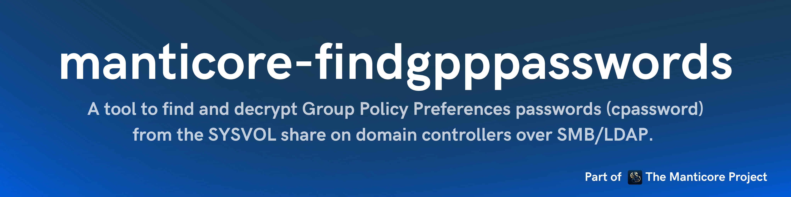

<p align="center">
    A tool to find and decrypt Group Policy Preferences passwords (cpassword) from the SYSVOL share on domain controllers over SMB/LDAP.
    <br>
    <a href="https://github.com/TheManticoreProject/FindGPPPasswords/actions/workflows/release.yaml" title="Build"></a>
    
     
    <br>
</p>

## Features

 - [x] Only requires a **low privileges domain user account**.
 - [x] Automatically gets the list of all domain controllers from the LDAP.
 - [x] Finds all the Group Policy Preferences Passwords present in SYSVOL share on each domain controller.
 - [x] Decrypts the passwords and prints them in cleartext.
 - [x] Outputs to a Excel file with option `--export-xlsx <path_to_xlsx_file>`.
 - [x] Option to test the credentials of the found GPP passwords with the `--test-credentials` option.
 - [x] Multi-threaded mode with option `--threads <number_of_threads>`.

## Usage

By default, the tool finds and prints all Group Policy Preferences passwords in cleartext:

```bash
$ ./FindGPPPasswords --domain <domain> --username <username> --password <password> --dc-ip <dc-ip>
```

To test credentials of found passwords:

```bash
$ ./FindGPPPasswords --domain <domain> --username <username> --password <password> --dc-ip <dc-ip> --test-credentials
```

For full usage information:

```              
$ ./FindGPPPasswords -h
FindGPPPasswords - by Remi GASCOU (Podalirius) @ TheManticoreProject - v1.2

Usage: FindGPPPasswords [--quiet] [--debug] [--no-colors] [--export-xlsx <string>] [--test-credentials] --domain <string> --username <string> [--password <string>] [--hashes <string>] [--threads <int>] [--nameserver <string>] --dc-ip <string> [--ldap-port <tcp port>] [--use-ldaps]

  -q, --quiet      Show no information at all. (default: false)
  --debug          Debug mode. (default: false)
  -nc, --no-colors No colors mode. (default: false)

  Additional Options:
    -x, --export-xlsx <string> Path to output Excel file. (default: "")
    -tc, --test-credentials    Test credentials. (default: false)

  Authentication:
    -d, --domain <string>   Active Directory domain to authenticate to.
    -u, --username <string> User to authenticate as.
    -p, --password <string> Password to authenticate with. (default: "")
    -H, --hashes <string>   NT/LM hashes, format is LMhash:NThash. (default: "")
    -T, --threads <int>     Number of threads to use. (default: 0)

  DNS Settings:
    -ns, --nameserver <string> IP Address of the DNS server to use in the queries. If omitted, it will use the IP of the domain controller specified in the -dc parameter. (default: "")

  LDAP Connection Settings:
    -dc, --dc-ip <string>       IP Address of the domain controller or KDC (Key Distribution Center) for Kerberos. If omitted, it will use the domain part (FQDN) specified in the identity parameter.
    -lp, --ldap-port <tcp port> Port number to connect to LDAP server. (default: 389)
    -L, --use-ldaps             Use LDAPS instead of LDAP. (default: false)
```

## Demonstration


Example with `--test-credentials`:


## Contributing

Pull requests are welcome. Feel free to open an issue if you want to add other features.

## Credits

- [Remi GASCOU (Podalirius)](https://github.com/p0dalirius) for the creation of the [FindGPPPasswords](https://github.com/p0dalirius/FindGPPPasswords) project before transferring it to TheManticoreProject.
